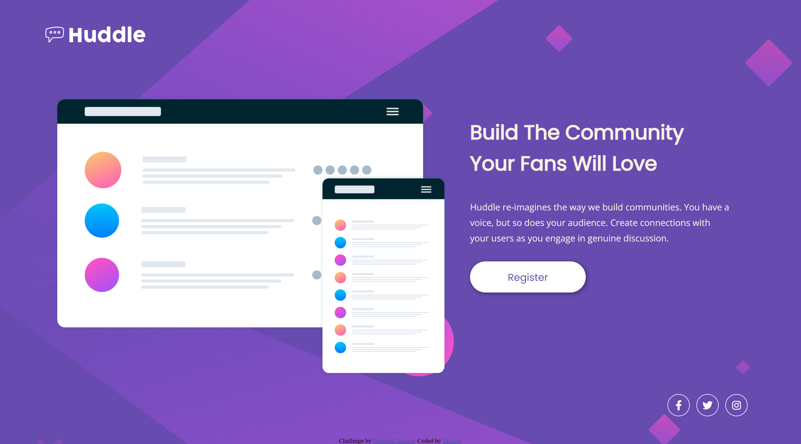

# Frontend Mentor - Huddle landing page with single introductory section solution

This is my solution to the [Huddle landing page with single introductory section challenge on Frontend Mentor](https://www.frontendmentor.io/challenges/huddle-landing-page-with-a-single-introductory-section-B_2Wvxgi0). Frontend Mentor challenges help you improve your coding skills by building realistic projects. 

## Table of contents

- [Overview](#overview)
  - [The challenge](#the-challenge)
  - [Screenshot](#screenshot)
  - [Links](#links)
- [My process](#my-process)
  - [Built with](#built-with)
  - [What I learned](#what-i-learned)
  - [Continued development](#continued-development)
  - [Useful resources](#useful-resources)
- [Author](#author)


## Overview

### The challenge

Users should be able to:

- View the optimal layout for the page depending on their device's screen size
- See hover states for all interactive elements on the page

### Screenshot



### Links

- Live Site URL: [https://tascate.github.io/huddle-landing-page-challenge/](https://tascate.github.io/huddle-landing-page-challenge/)

## My process

### Built with

- Semantic HTML5 markup
- Flexbox
- CSS Grid
- Mobile-first workflow

### What I learned

One of the major learnings in this challenge is how to utilize CSS Grid. Coming into this challenge, I wanted to try using CSS grid for some of the layout building alongside Flexbox. I used it mainly to create the two column style that the desktop layout has and became familiar with how to setup and manipulate a CSS Grid.

```css {
    main {
        ...
        display: grid;
        gap: 2.5rem;
        grid-template-columns: auto auto;
        ...
    }
}
```

For this project, I also began with a mobile-first approach. The reasoning that I saw is that a mobile-first approach would simplify the CSS layout as beginning with the simpler mobile layout would be quick to create. Afterwards, the desktop layout can easily be added on by adding new elements and manipulating existing ones. I found it quite easier to work with the mobile layout first then worry about the desktop layout once finished. Adapting the mobile layout into desktop was effortless after.

### Continued development

I want to continue focusing on looking for more ways where CSS grid can be applied as a better solution then CSS flexbox. As well as become more familiar with utilizing CSS grid. 

**Note: Delete this note and the content within this section and replace with your own plans for continued development.**

### Useful resources

- [CSS Grids](https://css-tricks.com/snippets/css/complete-guide-grid/#prop-grid-column-row-start-end) - This site helped me in explaining CSS grids and what they offer when compared against Flexbox
## Author

- Frontend Mentor - [@Tascate](https://www.frontendmentor.io/profile/Tascate)
